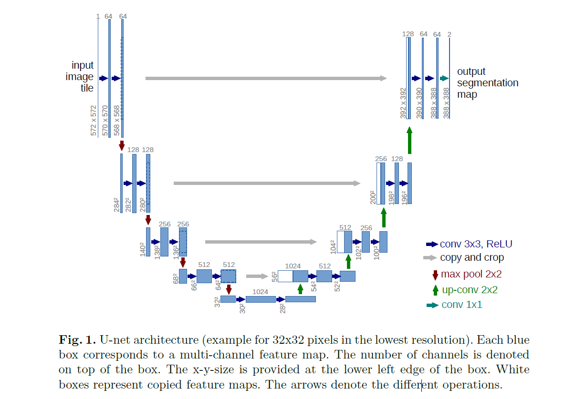

# Electron Microscopy Image Segmentation

- Dataset from: [ISBI Challenge 2012](1http://brainiac2.mit.edu/isbi challenge/)

- Models we've used: 
  - [U-Net](https://arxiv.org/pdf/1505.04597.pdf)
  - [U-Net++](https://arxiv.org/pdf/1807.10165.pdf)
  - [CE-Net](https://arxiv.org/pdf/1903.02740.pdf)

# U-Net:

#### What is U-Net:

U-Net is a convolutional neural network that was developed for biomedical image segmentation at the Computer Science Department of the University of Freiburg. The network is based on the fully convolutional network and its architecture was modified and extended to work with fewer training images and to yield more precise segmentations. Segmentation of a 512 × 512 image takes less than a second on a modern GPU.

#### Network Architecture:

The network consists of a contracting path and an expansive path, which gives it the u-shaped architecture. The contracting path is a typical convolutional network that consists of repeated application of convolutions, each followed by a rectified linear unit (ReLU) and a max pooling operation. During the contraction, the spatial information is reduced while feature information is increased. The expansive pathway combines the feature and spatial information through a sequence of up-convolutions and concatenations with high-resolution features from the contracting path.

#### Main idea

**Encoder-Decoder:**  当时这个结构提出的主要作用并不是分割，而是压缩图像和去噪声。输入是一幅图，经过下采样的编码，得到一串比原先图像更小的特征，相当于压缩，然后再经过一个解码，理想状况就是能还原到原来的图像。这样的话我们存一幅图的时候就只需要存一个特征和一个解码器即可。同理，这个思路也可以用在原图像去噪，做法就是在训练的阶段在原图人为的加上噪声，然后放到这个编码解码器中，目标是可以还原得到原图。

 Main components in U-net structure：

- 下采样
- 上采样
- skip connection

下采样可以增加对输入图像的一些小扰动的鲁棒性，比如图像平移，旋转等，减少过拟合的风险，降低运算量，和增加感受野的大小。升采样的最大的作用其实就是把抽象的特征再还原解码到原图的尺寸，最终得到分割结果。由于降采样过程中感受野逐渐变小，模型提取特征的侧重点不同。对于分类问题，只需关注深层特征，因此是一个FCN的结构；然而对图像语义分割而言，浅层特征和深层特征同样重要。因此通过添加Skip-connection，U-net方便了对浅层提取特征的上采样。Unet的skip connection属于长连接（后续的Unet++，Deep Layer Aggregation等用的均是短连接），它的好处是结构简单，可以高效的传播浅层提取的特征。它的缺点就是特征叠加方法较为简单，无法进行深层次的特征提取叠加。后续我们提到的Unet++就是对这个问题的有效改进。

#### Advantages

Unet is popular in medical image segmentation and it is often used as a baseline for newly proposed methods.  Medical images is a special kind of image which has the following two characters:

- The image semantics is relatively simple and the structure is relatively fixed. For the brain, we use brain CT and brain MRI. For chest X-ray, we only use chest X-ray CT. For fundus, we only use fundus OCT. All of them are imaging of a fixed organ instead of the whole body. Since organ structure itself is fixed and the semantic information is not particularly rich, both high-level semantic information and low-level features appear to be very important (Unet's skip connection and U-shaped structure come in handy).

# U-Net++

## Comparison with U-Net:

Unet++的结构本质上就是往原先Unet的结构中（图中黑色Backbone部分）填充不同层次之间的密集跳跃连接（图中绿色部分）。密集跳跃连接确保所有先验特征图都被累积，并通过每个跳跃路径上的dense卷积块而到达当前节点。这将在多个语义级别生成完整分辨率的特征映射。这时候原先的Unet变成了此结构的一个子集。Unet++采用此结构主要有两个好处：第一个好处就是对于各个深度的特征模型都能有效的提取。在训练的过程中模型通过梯度反向传播自主学习不同深度的特征的重要性，从而达到比Unet更好的特征提取性能。第二个好处是它共享了一个特征提取器，也就是你不需要训练一堆U-Net，而是只训练一个encoder，它的不同层次的特征由不同的decoder路径来还原。这个encoder可以灵活的用各种不同的backbone（如Resnet,VGG16,VGG19等）来代替，泛化性能优异。

图中红色的部分为深度监督（deep supervision）

## Advantages:

- 特征提取高效（如前所述）

- Unet++的结构使得模型可以被剪枝，从而降低模型的参数量：

  

  上图表明了剪枝的效果：$UNet++L^3$相比$UNet++L^4$剪枝了最右侧的backbone部分。在测试的阶段，由于输入的图像只会前向传播，剪枝掉的部分对前面的输出完全没有影响的；而在训练阶段，因为模型先进行前向传递再进行反向传播，被剪掉的部分会帮助其他部分做权重更新，因此我们只在测试的阶段进行剪枝，在训练的阶段保持原始网络结构。

  剪枝的好处：在深监督的过程中，每个子网络的输出都其实已经是图像的分割结果了，所以如果小的子网络的输出结果已经足够好了，我们可以剪掉那些多余的部分来缩减模型的参数量。这对移动端的应用大有好处，通过小的模型参量不仅可以节约储存空间，而且可以加快模型预测的速度。原始的论文实验结果表明，$UNet++L^2$的表现性能和$UNet++L^4$相差无几，然而它测试的速度是后者的三倍，模型的参数量也只是后者的$\frac{1}{16}$。

# CENet

## Comparison to U-Net:

## Advantages:

